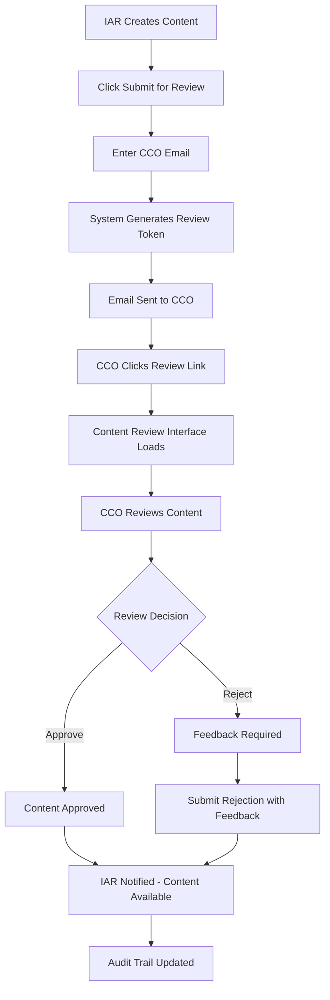

# Compliance Portal - Product Requirements Document (PRD)

**Document Version**: 1.0  
**Created**: July 7, 2025  
**Project**: FiduciaMVP Compliance Portal  
**Status**: Draft - Ready for Development Planning

---

## 📋 **Executive Summary**

### **Project Overview**
The FiduciaMVP Compliance Portal is a standalone microservice designed to revolutionize the content approval workflow between Investment Advisor Representatives (IARs) and Chief Compliance Officers (CCOs). This portal addresses the critical compliance bottleneck in financial services marketing content creation and distribution.

### **Business Objectives**
- **Reduce Compliance Review Time**: From weeks to days through streamlined digital workflow
- **Increase CCO Efficiency**: Centralized review dashboard with AI-assisted compliance checking
- **Expand Market Reach**: Freemium model attracts CCOs who wouldn't pay for full platform
- **Generate Additional Revenue**: $300/month/seat subscription model for full version
- **Establish Regulatory Leadership**: First platform to integrate AI compliance assistance for CCOs

### **Success Metrics**
- **Adoption**: 100+ CCOs using lite version within 6 months
- **Conversion**: 20% lite-to-full version conversion rate
- **Efficiency**: 50% reduction in average content review turnaround time
- **Revenue**: $50K+ monthly recurring revenue from full version subscriptions
- **Satisfaction**: 90%+ CCO satisfaction with review workflow efficiency

---

## 👥 **User Personas & Market Analysis**

### **Primary Persona: Chief Compliance Officer (CCO)**
**Demographics:**
- Title: Chief Compliance Officer, Compliance Manager, Director of Compliance
- Industry: Registered Investment Advisors (RIAs), Broker-Dealers, Financial Planning Firms
- Experience: 5-20 years in financial services compliance
- Technical Comfort: Moderate; uses email, basic software tools

**Pain Points:**
- Manual content review processes consume 10-20 hours per week
- Lack of standardized review workflow across multiple advisors
- Difficulty tracking compliance history and audit trails
- No centralized platform for managing multiple IAR relationships
- Time-consuming research to identify specific regulation violations

**Goals:**
- Streamline content approval workflow to focus on strategic compliance
- Maintain comprehensive audit trail for regulatory examinations
- Reduce liability through consistent, documented review processes
- Scale compliance oversight without proportional staff increases
- Access regulatory guidance quickly during content review

### **Secondary Persona: Investment Advisor Representative (IAR)**
**Demographics:**
- Licensed financial advisors managing client relationships
- Work at RIAs, independent firms, or large financial institutions
- Generate 5-20 pieces of marketing content monthly
- Current Fiducia users seeking compliance approval workflow

**Pain Points:**
- Content approval delays hurt marketing momentum and client engagement
- Unclear feedback requires multiple revision cycles
- No visibility into review status or estimated completion time
- Different CCOs have varying review processes and standards

**Goals:**
- Receive fast, clear compliance feedback to maintain marketing schedule
- Understand specific violations to improve future content creation
- Maintain audit trail for regulatory compliance
- Preserve content quality while meeting compliance requirements

---

## 🎯 **Product Vision & Strategy**

### **Vision Statement**
*"Create the world's first AI-powered compliance review platform that transforms content approval from a bottleneck into a competitive advantage for financial advisors."*

### **Strategic Positioning**
- **Unique Value Proposition**: Only platform combining AI compliance assistance with human expert review
- **Market Differentiation**: Freemium model removes barriers to CCO adoption
- **Competitive Advantage**: Deep integration with content creation workflow
- **Technology Leadership**: First to provide AI-assisted regulatory violation detection

### **Go-to-Market Strategy**
1. **Phase 1**: Launch lite version to current Fiducia advisor base
2. **Phase 2**: Beta test full version with select enterprise CCO partners
3. **Phase 3**: Public launch with industry conference demonstrations
4. **Phase 4**: Enterprise sales to large RIA networks and compliance firms

---

## 🏗️ **Product Architecture & Versions**

### **Two-Tier Product Strategy**

#### **Lite Version (Free)**
**Target Market**: CCOs serving individual advisors, small firms with limited compliance budget

**Core Value Proposition**: *"Review advisor content instantly without any platform investment"*

**Key Features:**
- Email-based secure content access
- Single content piece review interface
- Basic approve/reject workflow with feedback
- Company policy violation flagging
- FINRA/SEC regulation guidance
- Mobile-responsive design for on-the-go review

#### **Full Version ($300/month/seat)**
**Target Market**: Professional compliance officers, multi-advisor RIAs, compliance firms

**Core Value Proposition**: *"Complete compliance management platform with AI assistance and advanced analytics"*

**Key Features:**
- Multi-advisor dashboard with relationship management
- Complete content review history and audit trails
- Advanced feedback tools with inline commenting
- Warren AI integration for suggested content fixes
- Batch review operations and workflow automation
- Compliance analytics and reporting
- Custom policy management and violation templates
- Advanced notification and reminder systems

---

## 📋 **Detailed Feature Specifications**

### **🔓 Lite Version Features**

#### **1. Email-Based Secure Access**
**Business Requirement**: CCOs must access content without creating accounts or downloading apps

**Functional Requirements:**
- IAR enters CCO email in advisor portal
- System generates unique, secure review token
- Automated email with review link sent to CCO
- Link remains active until content is approved/rejected
- Multiple team members can access same link (forwarding support)

**Acceptance Criteria:**
- [ ] IAR can input CCO email address in advisor portal
- [ ] Email template includes clear instructions and review deadline
- [ ] Review link loads content within 3 seconds
- [ ] Link works on mobile devices without app installation
- [ ] Security token expires only after review completion

#### **2. Content Review Interface**
**Business Requirement**: CCOs need clear, focused interface to review content efficiently

**Functional Requirements:**
- Display content in original format (LinkedIn post, email template, etc.)
- Show IAR information (name, firm, contact details)
- Display target platform and intended audience
- Highlight content sections for focused review
- Provide violation type selection (Company Policy, FINRA, SEC)

**Acceptance Criteria:**
- [ ] Content displays exactly as it will appear on target platform
- [ ] IAR contact information clearly visible
- [ ] Platform and audience information prominently displayed
- [ ] Text selection and highlighting functionality works smoothly
- [ ] Violation categorization options are comprehensive

#### **3. Feedback and Decision System**
**Business Requirement**: CCOs must provide structured feedback that helps IARs improve content

**Functional Requirements:**
- Inline commenting on specific content sections
- Overall content feedback summary
- Violation type classification with regulatory references
- Approve/reject decision with required feedback for rejections
- AI assistance for identifying specific regulation violations

**Acceptance Criteria:**
- [ ] CCO can highlight text and add section-specific comments
- [ ] Overall feedback field supports rich text formatting
- [ ] Violation types link to specific FINRA/SEC rule references
- [ ] Rejection requires detailed explanation
- [ ] AI suggestions provide accurate regulatory citations

#### **4. Mobile-Responsive Design**
**Business Requirement**: CCOs often review content outside office hours on mobile devices

**Functional Requirements:**
- Fully functional review interface on phones and tablets
- Touch-friendly commenting and highlighting
- Readable text without zooming
- Fast loading on mobile networks

**Acceptance Criteria:**
- [ ] All features work on iOS and Android browsers
- [ ] Interface adapts to screen sizes 320px and above
- [ ] Touch targets meet accessibility guidelines (44px minimum)
- [ ] Page loads in under 5 seconds on 3G connections

#### **5. Upgrade Call-to-Action**
**Business Requirement**: Convert lite users to paid subscriptions through strategic upgrade prompts

**Functional Requirements:**
- Contextual upgrade prompts highlighting full version benefits
- Clear pricing and feature comparison
- Self-service upgrade flow
- Progress tracking for review efficiency gains

**Acceptance Criteria:**
- [ ] Upgrade CTA appears after completing first review
- [ ] Feature comparison shows clear value proposition
- [ ] Upgrade flow completes without technical support
- [ ] Trial period begins immediately upon upgrade

### **🔐 Full Version Features**

#### **1. Multi-Advisor Dashboard**
**Business Requirement**: CCOs managing multiple advisors need centralized oversight

**Functional Requirements:**
- Dashboard showing all connected advisors
- Pending content reviews prioritized by age
- Content review history with search and filtering
- Advisor performance analytics and trends
- Bulk review operations for efficiency

**Acceptance Criteria:**
- [ ] Dashboard loads all advisor data within 5 seconds
- [ ] Pending reviews sorted by submission date (oldest first)
- [ ] Search finds content by advisor, platform, or keywords
- [ ] Analytics show monthly review volume and turnaround times
- [ ] Bulk operations handle up to 50 pieces simultaneously

#### **2. Advanced Feedback Tools**
**Business Requirement**: Professional CCOs need sophisticated review and feedback capabilities

**Functional Requirements:**
- Inline commenting with threaded discussions
- Version comparison showing content changes
- Template feedback for common violations
- Collaboration tools for multi-reviewer teams
- Feedback templates and standardized responses

**Acceptance Criteria:**
- [ ] Comments support rich text, links, and formatting
- [ ] Version history shows all content iterations clearly
- [ ] Template library reduces review time by 30%
- [ ] Multiple reviewers can collaborate on single content piece
- [ ] Standardized responses maintain consistency

#### **3. Warren AI Integration**
**Business Requirement**: CCOs need AI assistance to improve content rather than just rejecting it

**Functional Requirements:**
- Warren chat interface accessible during content review
- AI-suggested content improvements with regulatory rationale
- Automated violation detection with specific rule citations
- Suggested content rewrites that maintain original intent
- Tracking of AI-assisted changes for audit trail

**Acceptance Criteria:**
- [ ] Warren integration loads within existing review interface
- [ ] AI suggestions include specific FINRA/SEC rule references
- [ ] Suggested changes preserve original content intent
- [ ] All AI interactions logged for compliance audit
- [ ] IAR receives suggested changes for approval

#### **4. Compliance Analytics & Reporting**
**Business Requirement**: CCOs need data insights for regulatory reporting and process improvement

**Functional Requirements:**
- Review turnaround time analytics
- Violation pattern analysis across advisors
- Regulatory compliance scoring
- Automated compliance reports for regulatory examinations
- Trend analysis for proactive compliance management

**Acceptance Criteria:**
- [ ] Analytics update in real-time as reviews are completed
- [ ] Violation patterns identify training opportunities
- [ ] Compliance scores align with regulatory standards
- [ ] Reports export in PDF and Excel formats
- [ ] Trend data helps predict compliance risks

#### **5. Account & Seat Management**
**Business Requirement**: CCOs need flexible team management for compliance review operations

**Functional Requirements:**
- Self-service account creation and management
- Seat purchasing and team member invitation
- Role-based permissions for review team members
- Usage analytics and seat optimization recommendations
- Integration with existing compliance workflows

**Acceptance Criteria:**
- [ ] Account setup completes in under 10 minutes
- [ ] Seat management handles teams of 1-50 reviewers
- [ ] Permissions prevent unauthorized access to sensitive content
- [ ] Usage analytics identify seat optimization opportunities
- [ ] Integration APIs support existing compliance tools

---

## 🔐 **Authentication & Security Framework**

### **Lite Version Security Model**
**Philosophy**: Maximum accessibility with minimal friction while maintaining content security

**Implementation:**
- **Token-Based Access**: Unique, cryptographically secure tokens for each content review
- **Time-Limited Validity**: Tokens expire only after review completion or explicit expiration
- **Forward-Safe Design**: Links can be forwarded to compliance team members
- **No Account Required**: Zero-friction access for CCO convenience
- **Audit Logging**: Complete access logs for compliance tracking

**Security Controls:**
```
Content Review Token Generation:
├── Cryptographically secure random token (256-bit)
├── Signed with system secret for tamper detection
├── Includes content ID and expiration rules
├── Single-use for approval/rejection but reusable for viewing
└── Audit trail logs all access attempts
```

### **Full Version Security Model**
**Philosophy**: Enterprise-grade security with comprehensive audit trails and access controls

**Implementation:**
- **Account-Based Authentication**: Full user accounts with secure credentials
- **Multi-Factor Authentication**: Required for all account access
- **Role-Based Access Control**: Granular permissions for compliance team roles
- **Session Management**: Secure session handling with appropriate timeouts
- **Enterprise Integration**: SSO compatibility for large organizations

**Security Controls:**
```
Enterprise Security Framework:
├── OAuth 2.0 / SAML integration capabilities
├── Password policy enforcement (12+ characters, complexity)
├── MFA required (SMS, authenticator app, or hardware token)
├── Role-based permissions (Admin, Reviewer, Viewer)
├── Session timeout (30 minutes idle, 8 hours maximum)
├── IP whitelisting for enterprise accounts
└── Comprehensive audit logs for regulatory compliance
```

---

## 🔌 **Integration Architecture**

### **Advisor Portal Integration Points**

#### **Content Submission Workflow**
```
Advisor Portal Content Submission:
├── IAR creates content in Warren or Library
├── IAR clicks "Submit for Review" button
├── System prompts for CCO email (lite) or selects connected CCO (full)
├── Content status changes to "In Review"
├── Email notification sent to CCO
├── Review link generated and stored
└── Advisor receives confirmation of submission
```

#### **Review Completion Workflow**
```
CCO Review Completion:
├── CCO submits approve/reject decision
├── Content status updates in advisor portal
├── IAR receives email notification
├── In-app notification appears in advisor portal
├── Feedback and suggestions added to content record
├── Audit trail updated with review details
└── Content available for distribution (if approved)
```

### **Shared Data Access Strategy**

#### **Database Integration Model**
```sql
-- Extend existing advisor schema
ALTER TABLE advisor_content ADD COLUMN cco_review_status VARCHAR(50);
ALTER TABLE advisor_content ADD COLUMN cco_review_token VARCHAR(255);
ALTER TABLE advisor_content ADD COLUMN submitted_for_review_at TIMESTAMP;

-- New compliance-specific tables
CREATE TABLE compliance_ccos (
    id UUID PRIMARY KEY,
    email VARCHAR(255) UNIQUE NOT NULL,
    subscription_type VARCHAR(50) DEFAULT 'lite',
    seats_purchased INTEGER DEFAULT 1,
    trial_ends_at TIMESTAMP,
    created_at TIMESTAMP DEFAULT NOW()
);

CREATE TABLE cco_iar_relationships (
    id UUID PRIMARY KEY,
    cco_id UUID REFERENCES compliance_ccos(id),
    iar_id UUID REFERENCES advisor_sessions(id),
    relationship_type VARCHAR(50) DEFAULT 'connected',
    created_at TIMESTAMP DEFAULT NOW()
);

CREATE TABLE content_reviews (
    id UUID PRIMARY KEY,
    content_id UUID REFERENCES advisor_content(id),
    cco_id UUID REFERENCES compliance_ccos(id),
    status VARCHAR(50) DEFAULT 'pending',
    overall_feedback TEXT,
    decision VARCHAR(20), -- 'approved', 'rejected', 'pending'
    reviewed_at TIMESTAMP,
    created_at TIMESTAMP DEFAULT NOW()
);

CREATE TABLE review_feedback (
    id UUID PRIMARY KEY,
    review_id UUID REFERENCES content_reviews(id),
    section_text TEXT,
    violation_type VARCHAR(100),
    comment TEXT,
    suggested_fix TEXT,
    regulation_reference TEXT,
    created_at TIMESTAMP DEFAULT NOW()
);
```

#### **API Strategy**
```typescript
// Compliance-specific endpoints
namespace: /api/v1/compliance/

// Shared endpoints with compliance access
/api/v1/advisor/content/{id} -- Reuse with compliance token auth
/api/v1/advisor/content/{id}/submit-review -- New advisor endpoint
/api/v1/compliance/content/{token} -- Lite version access
/api/v1/compliance/review/submit -- Submit review decision
/api/v1/compliance/dashboard/pending -- Full version dashboard
/api/v1/compliance/analytics/performance -- Full version analytics
```

---

## 📱 **User Experience Design Principles**

### **Lite Version UX Philosophy**
**"Invisible Complexity, Maximum Clarity"**

**Design Principles:**
- **Zero Learning Curve**: Interface intuitive enough for one-time use
- **Mobile-First Design**: Optimized for smartphone review workflows
- **Content-Focused Layout**: Minimal interface elements to focus on content review
- **Clear Action Hierarchy**: Approve/reject decisions prominently displayed
- **Contextual Help**: Inline guidance for regulation references and violation types

**Visual Design:**
```
Lite Version Interface Hierarchy:
├── Header: Fiducia branding + "Content Review" title
├── Content Card: Advisor info + content display
├── Review Tools: Highlighting, commenting, violation selection
├── Feedback Section: Overall comments and specific violations
├── Decision Panel: Approve/Reject with required fields
└── Footer: Upgrade CTA + Fiducia value proposition
```

### **Full Version UX Philosophy**
**"Professional Power with Intuitive Workflows"**

**Design Principles:**
- **Dashboard-Centric Design**: Overview-to-detail navigation pattern
- **Productivity-Focused**: Bulk operations and keyboard shortcuts
- **Data-Driven Interface**: Analytics and metrics prominently featured
- **Collaboration-Enabled**: Multi-user workflows and team coordination
- **Customizable Workspace**: User preferences and workflow optimization

**Visual Design:**
```
Full Version Interface Architecture:
├── Navigation Sidebar: Dashboard, Advisors, Analytics, Settings
├── Main Dashboard: Pending reviews, metrics, quick actions
├── Review Interface: Split-screen content + tools + Warren AI
├── Advisor Management: Relationship oversight + performance tracking
├── Analytics Dashboard: Compliance metrics + trend analysis
└── Settings Panel: Account management + team administration
```

---

## 🔄 **Workflow Specifications**

### **Lite Version Workflow**

#### **Content Submission to Review**


#### **Review Interface Workflow**
```
CCO Review Process:
1. Content Display
   ├── Original format preview (LinkedIn, email, etc.)
   ├── IAR information (name, firm, contact)
   ├── Target platform and audience details
   └── Submission date and urgency indicators

2. Review Tools
   ├── Text highlighting for specific sections
   ├── Inline commenting on highlighted text
   ├── Violation type selection (dropdown menu)
   ├── AI assistance for regulation identification
   └── Overall feedback text area

3. Decision Making
   ├── Approve: One-click approval with optional comments
   ├── Reject: Required feedback explaining violations
   ├── Request Changes: Specific improvement suggestions
   └── Save Draft: Partial review completion

4. Submission Confirmation
   ├── Review summary display
   ├── Final decision confirmation
   ├── Automatic IAR notification
   └── Upgrade CTA presentation
```

### **Full Version Workflow**

#### **Multi-Advisor Management**
```
Dashboard Workflow:
1. Overview Dashboard
   ├── Pending reviews count and aging
   ├── Recently approved/rejected content
   ├── Advisor performance metrics
   ├── Compliance trend analysis
   └── Quick action buttons

2. Advisor Relationship Management
   ├── Connected advisor list with status
   ├── Individual advisor content history
   ├── Performance analytics per advisor
   ├── Communication preferences
   └── Relationship status management

3. Bulk Review Operations
   ├── Multi-select pending reviews
   ├── Batch approval for similar content
   ├── Standardized rejection templates
   ├── Bulk feedback application
   └── Progress tracking for large batches

4. Analytics and Reporting
   ├── Review turnaround time analysis
   ├── Violation pattern identification
   ├── Advisor improvement trends
   ├── Regulatory compliance scoring
   └── Automated report generation
```

#### **Advanced Review Workflow with Warren AI**
```
AI-Enhanced Review Process:
1. Initial Content Analysis
   ├── Automated violation detection
   ├── Compliance risk scoring
   ├── Similar content comparison
   └── Regulatory reference suggestions

2. Warren AI Collaboration
   ├── CCO describes content issues to Warren
   ├── Warren suggests specific improvements
   ├── AI-generated content alternatives
   ├── Regulatory rationale for suggestions
   └── Version comparison tools

3. Collaborative Feedback
   ├── CCO reviews AI suggestions
   ├── Manual adjustments to AI recommendations
   ├── Combined human + AI feedback package
   ├── Suggested content alternatives
   └── Detailed improvement roadmap

4. IAR Collaboration
   ├── Comprehensive feedback delivery
   ├── AI-suggested content alternatives
   ├── Interactive revision workflow
   ├── Real-time collaboration tools
   └── Version control and approval tracking
```

---

## 🎯 **Success Metrics & KPIs**

### **Business Success Metrics**

#### **Adoption and Growth**
- **Lite Version Adoption**: 100+ active CCOs within 6 months
- **Full Version Conversion**: 20% lite-to-full conversion rate
- **Advisor Integration**: 80% of active Fiducia advisors submit content for review
- **Review Volume**: 1,000+ content pieces reviewed monthly
- **Geographic Expansion**: CCOs from all 50 US states using platform

#### **Revenue Metrics**
- **Monthly Recurring Revenue**: $50,000+ from full version subscriptions
- **Average Revenue Per User**: $300/month for full version CCOs
- **Customer Lifetime Value**: $10,800 (36-month average subscription)
- **Customer Acquisition Cost**: <$500 per full version CCO
- **Revenue Growth Rate**: 15% month-over-month growth

#### **Market Penetration**
- **RIA Coverage**: 500+ RIA firms with connected CCOs
- **Compliance Firm Partnerships**: 25+ dedicated compliance firms using platform
- **Industry Recognition**: 3+ financial services industry awards or recognitions
- **Competitive Differentiation**: Maintain 18-month technology leadership gap

### **Operational Success Metrics**

#### **Efficiency and Performance**
- **Review Turnaround Time**: Average 2 days (vs. industry standard 5-7 days)
- **Content Approval Rate**: 85% first-time approval rate
- **CCO Time Savings**: 50% reduction in time spent per content review
- **Advisor Satisfaction**: 90%+ satisfaction with review process speed and clarity
- **System Uptime**: 99.9% availability during business hours

#### **Quality and Compliance**
- **Regulatory Compliance**: Zero regulatory violations from reviewed content
- **Audit Trail Completeness**: 100% of reviews have complete audit documentation
- **Feedback Quality**: 95% of advisors find feedback actionable and specific
- **Violation Detection Accuracy**: 90%+ accuracy in automated violation identification
- **Regulatory Update Integration**: New regulations integrated within 30 days

#### **User Experience Metrics**
- **Interface Usability**: <5 minutes to complete first content review
- **Mobile Experience**: 80% of lite version reviews completed on mobile devices
- **Support Ticket Volume**: <2% of users require technical support
- **Feature Adoption**: 70% of full version users utilize Warren AI assistance
- **Upgrade Path Success**: 95% successful self-service upgrades from lite to full

### **Technical Performance Metrics**

#### **System Performance**
- **Page Load Times**: <3 seconds for content review interface
- **API Response Times**: <500ms for all critical user interactions
- **Database Query Performance**: <100ms for dashboard and review queries
- **Concurrent User Support**: 500+ simultaneous CCO reviews without degradation
- **Mobile Performance**: <5 seconds load time on 3G connections

#### **Security and Compliance**
- **Security Incidents**: Zero data breaches or unauthorized access
- **Audit Trail Integrity**: 100% of user actions logged and retrievable
- **Token Security**: Zero compromised review tokens or unauthorized access
- **Data Retention Compliance**: 100% compliance with financial services data retention rules
- **Privacy Protection**: Zero personally identifiable information leaks

---

## 🚨 **Risk Assessment & Mitigation**

### **Technical Risks**

#### **High Priority Risks**
1. **Database Integration Complexity**
   - **Risk**: Complex data relationships between advisor and compliance portals
   - **Impact**: Development delays, data integrity issues
   - **Mitigation**: Comprehensive database design review, extensive testing
   - **Owner**: Technical Architecture Team

2. **Authentication Security**
   - **Risk**: Token-based access could be compromised or misused
   - **Impact**: Unauthorized content access, regulatory compliance violations
   - **Mitigation**: Cryptographic security review, penetration testing
   - **Owner**: Security Team

3. **Performance at Scale**
   - **Risk**: System performance degradation with high CCO adoption
   - **Impact**: Poor user experience, customer churn
   - **Mitigation**: Load testing, scalable architecture design
   - **Owner**: DevOps Team

#### **Medium Priority Risks**
4. **Third-Party Integration Dependencies**
   - **Risk**: Email delivery services or Warren AI service disruptions
   - **Impact**: Broken notification workflow, reduced functionality
   - **Mitigation**: Multiple service providers, graceful degradation
   - **Owner**: Integration Team

5. **Mobile Compatibility Issues**
   - **Risk**: Review interface not fully functional on all mobile devices
   - **Impact**: Reduced CCO adoption, poor user experience
   - **Mitigation**: Comprehensive mobile testing, progressive web app approach
   - **Owner**: Frontend Team

### **Business Risks**

#### **High Priority Risks**
1. **Market Adoption Resistance**
   - **Risk**: CCOs reluctant to change existing review processes
   - **Impact**: Low adoption rates, missed revenue targets
   - **Mitigation**: Extensive user research, change management support
   - **Owner**: Product Marketing Team

2. **Regulatory Compliance Requirements**
   - **Risk**: Platform must meet evolving financial services regulations
   - **Impact**: Legal liability, customer loss, regulatory sanctions
   - **Mitigation**: Legal review, compliance expert advisory board
   - **Owner**: Compliance Team

3. **Competitive Response**
   - **Risk**: Established compliance software providers develop similar features
   - **Impact**: Reduced market differentiation, pricing pressure
   - **Mitigation**: Patent protection, rapid innovation, customer lock-in
   - **Owner**: Strategy Team

#### **Medium Priority Risks**
4. **Customer Support Scalability**
   - **Risk**: Support team overwhelmed by CCO onboarding and questions
   - **Impact**: Poor customer experience, negative reviews
   - **Mitigation**: Self-service resources, automated onboarding
   - **Owner**: Customer Success Team

5. **Pricing Model Acceptance**
   - **Risk**: $300/month pricing too high for market acceptance
   - **Impact**: Low conversion rates, revenue shortfall
   - **Mitigation**: Flexible pricing tiers, value demonstration
   - **Owner**: Revenue Team

---

## 📅 **Development Roadmap & Timeline**

### **Phase 1: MVP Lite Version (8-10 weeks)**

#### **Sprint 1-2: Foundation & Architecture (2 weeks)**
- [ ] Project setup and microservices architecture
- [ ] Database schema design and implementation
- [ ] Basic authentication and security framework
- [ ] Integration with existing advisor portal
- [ ] Core API endpoints for content submission

#### **Sprint 3-4: Lite Version Core Features (2 weeks)**
- [ ] Email-based review link generation
- [ ] Content review interface development
- [ ] Basic approve/reject workflow
- [ ] Inline commenting and feedback system
- [ ] Mobile-responsive design implementation

#### **Sprint 5-6: Advanced Review Tools (2 weeks)**
- [ ] Violation type classification system
- [ ] AI assistance for regulation identification
- [ ] Overall feedback and decision system
- [ ] Email notification integration
- [ ] Upgrade CTA and pricing page

#### **Sprint 7-8: Testing & Polish (2 weeks)**
- [ ] Comprehensive testing across devices and browsers
- [ ] Security penetration testing
- [ ] Performance optimization
- [ ] Beta testing with select CCOs
- [ ] Documentation and training materials

### **Phase 2: Full Version Foundation (6-8 weeks)**

#### **Sprint 9-10: Account Management (2 weeks)**
- [ ] Full authentication system with MFA
- [ ] Account creation and seat management
- [ ] CCO-IAR relationship management
- [ ] Role-based access control implementation
- [ ] Trial period and subscription management

#### **Sprint 11-12: Advanced Dashboard (2 weeks)**
- [ ] Multi-advisor oversight dashboard
- [ ] Pending review prioritization system
- [ ] Content review history and search
- [ ] Bulk review operations
- [ ] Advanced notification system

#### **Sprint 13-14: Warren AI Integration (2 weeks)**
- [ ] Warren chat interface for CCOs
- [ ] AI-suggested content improvements
- [ ] Automated violation detection enhancement
- [ ] Collaborative review workflow
- [ ] AI-human feedback combination system

#### **Sprint 15-16: Analytics & Reporting (2 weeks)**
- [ ] Compliance analytics dashboard
- [ ] Performance metrics and trend analysis
- [ ] Automated reporting system
- [ ] Export capabilities (PDF, Excel)
- [ ] Regulatory audit trail enhancement

### **Phase 3: Enterprise Features (4-6 weeks)**

#### **Sprint 17-18: Advanced Collaboration (2 weeks)**
- [ ] Multi-reviewer collaboration tools
- [ ] Template feedback library
- [ ] Version comparison and change tracking
- [ ] Advanced commenting with threading
- [ ] Workflow automation features

#### **Sprint 19-20: Integration & API (2 weeks)**
- [ ] Public API for third-party integrations
- [ ] Webhook system for external notifications
- [ ] SSO integration capabilities
- [ ] Advanced security features
- [ ] Enterprise onboarding tools

#### **Sprint 21-22: Polish & Launch Preparation (2 weeks)**
- [ ] Performance optimization for scale
- [ ] Comprehensive security audit
- [ ] User acceptance testing
- [ ] Marketing materials and demos
- [ ] Public launch preparation

---

## ✅ **Acceptance Criteria & Definition of Done**

### **MVP Lite Version Acceptance Criteria**

#### **Core Functionality**
- [ ] IAR can submit content for review from advisor portal
- [ ] CCO receives email with secure review link within 2 minutes
- [ ] Review interface loads within 3 seconds on desktop and mobile
- [ ] CCO can approve content with optional comments
- [ ] CCO can reject content with required detailed feedback
- [ ] IAR receives notification of review decision within 5 minutes
- [ ] Content status updates correctly in advisor portal
- [ ] Complete audit trail maintained for all review actions

#### **User Experience Standards**
- [ ] Interface works without JavaScript errors on Chrome, Firefox, Safari, Edge
- [ ] Mobile interface functions fully on iOS and Android devices
- [ ] Text highlighting and commenting works smoothly
- [ ] Upgrade CTA appears contextually without being intrusive
- [ ] Loading states and error messages provide clear user feedback
- [ ] Help documentation accessible and comprehensive

#### **Security Requirements**
- [ ] Review tokens are cryptographically secure and tamper-proof
- [ ] No unauthorized access to content without valid token
- [ ] All user actions logged for audit trail
- [ ] Email content includes appropriate security warnings
- [ ] Link sharing functionality works as designed
- [ ] Data transmission encrypted with HTTPS

#### **Integration Standards**
- [ ] Seamless integration with advisor portal submission workflow
- [ ] Real-time status updates between portals
- [ ] Email notifications reliable and properly formatted
- [ ] Database transactions maintain integrity
- [ ] API responses include appropriate error handling
- [ ] Performance meets stated load time requirements

### **Full Version Acceptance Criteria**

#### **Advanced Functionality**
- [ ] Multi-advisor dashboard displays all connected advisors accurately
- [ ] Pending reviews prioritized by submission age
- [ ] Bulk operations handle up to 50 content pieces simultaneously
- [ ] Warren AI integration provides relevant improvement suggestions
- [ ] Analytics dashboard updates in real-time with accurate data
- [ ] Account management supports team collaboration features

#### **Business Logic Validation**
- [ ] Subscription management works for 1-50 seat teams
- [ ] Trial period enforcement and conversion flow functional
- [ ] Role-based permissions prevent unauthorized access
- [ ] Billing integration calculates costs correctly
- [ ] Compliance reporting meets regulatory standards
- [ ] Data retention policies implemented correctly

---

## 📞 **Stakeholder Communication Plan**

### **Development Team Communication**
- **Daily Standups**: Progress updates and blocker identification
- **Sprint Reviews**: Stakeholder demos and feedback collection
- **Technical Architecture Reviews**: Complex integration decision points
- **Security Reviews**: Weekly security and compliance assessment

### **Business Stakeholder Updates**
- **Weekly Progress Reports**: Feature completion and timeline updates
- **Monthly Business Reviews**: Metrics analysis and strategy alignment
- **Quarterly Strategy Sessions**: Market feedback and roadmap adjustment
- **Release Communications**: Launch preparation and marketing coordination

### **Beta User Engagement**
- **Beta Recruitment**: Identify 10-15 CCO participants for testing
- **Weekly Feedback Sessions**: User experience and feature feedback
- **Bug Report Management**: Structured feedback collection and response
- **Success Story Documentation**: Case studies and testimonial collection

---

## 🎯 **Next Steps & Action Items**

### **Immediate Actions (This Week)**
1. **Technical Architecture Document**: Create detailed system design
2. **API Specification Document**: Define all endpoints and data models
3. **User Experience Wireframes**: Design key interface workflows
4. **Development Epic Creation**: Break down features into Jira epics
5. **Beta CCO Recruitment**: Identify testing participants

### **Short-term Priorities (Next 2 Weeks)**
1. **Database Schema Implementation**: Create compliance tables
2. **Project Setup**: Initialize frontend-compliance microservice
3. **Basic Authentication**: Implement token-based security
4. **Core API Development**: Build content submission and review endpoints
5. **Integration Testing**: Validate advisor portal connection

### **Long-term Commitments (Next Quarter)**
1. **MVP Launch**: Deploy lite version to production
2. **Beta Testing Program**: Comprehensive user feedback collection
3. **Full Version Development**: Begin advanced feature implementation
4. **Market Validation**: Confirm product-market fit metrics
5. **Enterprise Sales Preparation**: Develop sales materials and processes

---

**This Product Requirements Document serves as the definitive guide for Compliance Portal development, ensuring all stakeholders have clear understanding of business objectives, technical requirements, and success criteria.**